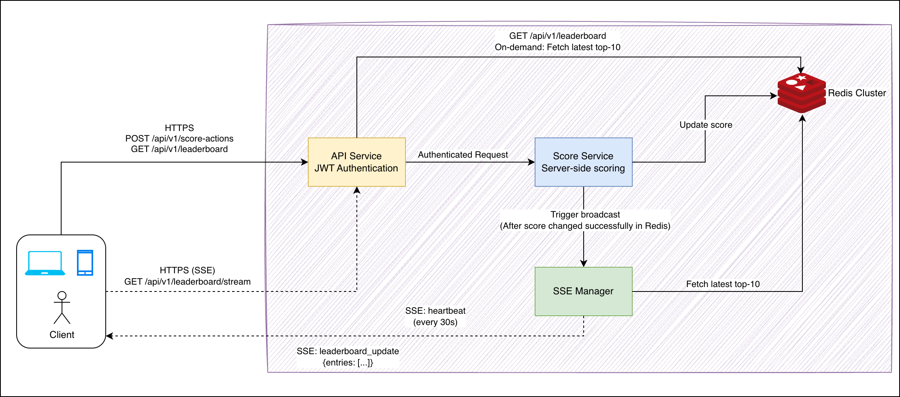
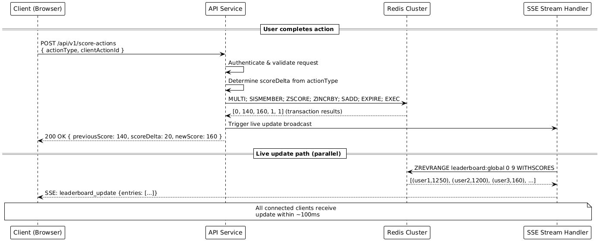

# Live Scoreboard API Service Module

## Overview

API service for a **live top-10 scoreboard** with real-time updates. Users complete actions to increase scores, and all connected clients see live leaderboard changes.

**Key Features:**

- Score increment API with JWT authentication
- Top-10 leaderboard retrieval
- Real-time updates via Server-Sent Events
- Anti-fraud: server-side scoring, idempotency, rate limiting

---

## 2. Scope & Assumptions

### In Scope

- APIs to:
  - Increment a user’s score when an action is completed
  - Read the top-10 leaderboard
  - Subscribe to live leaderboard updates
- Data model for scores and score events
- Basic security / anti-fraud mechanisms around score updates
- High-level architecture and execution flow

### Out of Scope

- Defining what the **action** is in business terms
- UI implementation of the scoreboard
- Full user/account management (authentication is assumed to exist)
- Detailed infrastructure concerns (exact deployment topology, specific cloud provider products)

### Assumptions

- JWT authentication exists, Redis Cluster available

---

## 3. Requirements

### 3.1 Functional Requirements

- **F1. Score Increment**: When a user completes an action, the frontend calls an API to **increase** that user's score.
- **F2. Leaderboard Retrieval**: Provide an API to return the **top 10** users by score (optionally configurable `limit` up to a reasonable maximum).
- **F3. Live Updates**: Clients viewing the scoreboard must receive **live updates** when scores change, without manual page refresh.
- **F4. User Identity**: The service determines the user identity from the authenticated context, not from arbitrary client-provided IDs.
- **F5. Auditability**: Score changes must be recorded so suspicious activity can be inspected later.

### 3.2 Non-Functional Requirements

- **N1. Latency**: Leaderboard read latency target p95 < 100 ms; SSE broadcasts within 100ms.
- **N2. Throughput**: Support peak gaming hours with 350+ score updates/sec and 3,500+ reads/sec.
- **N3. Availability**: 99.9% uptime; leaderboard reads remain available even if SSE is degraded.
- **N4. Consistency**: Redis atomic operations ensure immediate consistency for score updates.
- **N5. Security**: Prevent unauthorized score manipulation through JWT authentication, server-side validation, and rate limiting.
- **N6. Observability**: Health check endpoint, QPS/latency/error rate metrics for monitoring.

---

## 4. Architecture



**Architecture Components:**

- **API Layer**: REST endpoints + SSE for live updates with JWT authentication
- **Score Service**: Business logic, idempotency, atomic operations, rate limiting
- **Redis Cluster**: Primary store (6+ nodes) - leaderboard ZSET, processed SET
- **SSE Manager**: Real-time leaderboard broadcasts to clients
  - **Live Update Pipeline**: Fetches latest top-10 from Redis and broadcasts
  - **Connection Heartbeat**: Keeps connections alive with periodic pings

---

## 5. Back-of-the-Envelope Calculations

### Scale Estimates

- **Active Users**: 100K daily active users (DAU)
- **Score Updates**: Each user performs 10 actions/day on average
- **Peak Load**: 3x average during peak hours (evening gaming)
- **Read/Write Ratio**: 10:1 (users read leaderboard more than update scores)

### Traffic Calculations

**Write Operations (Score Updates):**

- Daily: 100K users × 10 actions = 1M score updates/day
- Peak QPS: 1M ÷ 86,400s × 3 (peak multiplier) = ~35 writes/sec
- With growth buffer (10x): **350 score updates/sec**

**Read Operations (Leaderboard):**

- Daily: 1M score updates × 10 (read ratio) = 10M reads/day
- Peak QPS: 10M ÷ 86,400s × 3 = ~347 reads/sec
- With growth buffer (10x): **3,500 leaderboard reads/sec**

**SSE Connections:**

- Concurrent viewers: 5% of DAU = 5,000 active connections
- Memory per connection: 4KB
- Total SSE memory: 5,000 × 4KB = **20MB per server**

### Storage Requirements

**Redis Memory (Hot Data):**

- Leaderboard ZSET: 100K users × 32 bytes = 3.2MB
- Idempotency sets: 100K users × 50 actions × 16 bytes = 80MB (24h TTL)
- Total hot data: **~83MB fits easily in memory**

---

## 6. Data Model & Implementation

### 6.1 Primary Data Store (Redis Cluster)

For high-performance live scoreboard operations:

```redis
# Leaderboard (Sorted Set)
ZSET leaderboard:global
# Structure: user_id (member) → score (value)
# Operations: ZINCRBY, ZREVRANGE, ZREVRANK, ZSCORE

# Idempotency Tracking (Set with TTL)
SET processed:{user_id}
# Members: client_action_id values
# TTL: 86400 seconds (24 hours)
# Operations: SADD, SISMEMBER, EXPIRE
```

---

## 7. API Endpoints

All APIs use `/api/v1` prefix with JWT authentication.

### 7.1 POST /api/v1/score-actions

**Purpose:**
Record completion of a user action and increment that user's score accordingly.

**Authentication:**
Required (Bearer token).

**Request Body:**

```json
{
  "actionType": "string",
  "clientActionId": "string",
  "metadata": {
    "client": "web",
    "additionalContext": "optional"
  }
}
```

- `actionType`: logical type of the action (to be mapped server-side to a score delta).
- `clientActionId`: unique identifier per action occurrence, used for idempotency (e.g. UUID generated by the client).
- `metadata`: optional. Used for logging/analysis only. Not trusted for security.

**Server Behavior:**

1. **Authentication**: Extract `user_id` from JWT `sub` claim
2. **Validation**: Check `actionType` whitelist, `clientActionId` format
3. **Score Calculation**: Map `actionType` → `score_delta` (server-side config)
4. **Redis Atomic Transaction**:

   ```redis
   MULTI
   # Check if action already processed
   SISMEMBER processed:{user_id} {client_action_id}
   # Get current score for response
   ZSCORE leaderboard:global {user_id}
   # Update score atomically (if not duplicate)
   ZINCRBY leaderboard:global {score_delta} {user_id}
   # Mark action as processed
   SADD processed:{user_id} {client_action_id}
   EXPIRE processed:{user_id} 86400
   EXEC
   ```

5. **Result Validation**: Check EXEC results for successful atomic update
6. **SSE Notification**: Trigger live update broadcast to connected clients
7. **Response**: Return success with previous/new scores

**Response (on success):**

```json
{
  "userId": "user-123",
  "previousScore": 140,
  "scoreDelta": 10,
  "newScore": 150,
  "applied": true
}
```

`applied = false` may be used if this was an idempotent replay (same `clientActionId`, no new increment).

**Error Cases:**

- `400` Invalid body/actionType
- `401` Invalid/expired JWT
- `409` Duplicate clientActionId
- `429` Rate limit exceeded
- `500` Server error

### 7.2 GET /api/v1/leaderboard

Retrieve top-N users by score (default 10).

**Query Parameters:** `limit` (optional, max 100)
**Authentication:** Optional

```redis
# Leaderboard Query
ZREVRANGE leaderboard:global 0 9 WITHSCORES  # Top 10 with scores
```

**Response Example:**

```json
{
  "entries": [
    {
      "rank": 1,
      "userId": "user-1",
      "score": 1230
    },
    {
      "rank": 2,
      "userId": "user-2",
      "score": 1200
    }
  ],
  "generatedAt": "2025-01-20T10:30:00Z"
}
```

### 7.3 GET /api/v1/leaderboard/stream

Server-Sent Events (SSE) for live leaderboard updates.

**Authentication:** Required
**Content-Type:** `text/event-stream`

**Events:**

- `leaderboard_update`: New top-10 data
- `heartbeat`: Keep connection alive

```javascript
const eventSource = new EventSource("/api/v1/leaderboard/stream");
eventSource.addEventListener("leaderboard_update", (event) => {
  const data = JSON.parse(event.data);
  updateUI(data.entries);
});
```

**SSE**: JWT auth, heartbeat every 30s, broadcast top-10 updates ~100ms latency

---

## 8. Sequence Diagaram



---

## 9. Security & Abuse Prevention

This section addresses the requirement to prevent malicious users from increasing scores without authorisation.

### 8.1 Authentication & Authorisation

- All score update and stream endpoints require authenticated requests.
- User identity is derived from the token; the client cannot specify an arbitrary `userId` to increment.
- If necessary, service-level tokens (with stricter scopes) can be used by trusted internal systems.

### 8.2 Server-Side Score Calculation

- The client never sends the new score.
- The client never sends the score delta directly.
- The server maps `actionType → score_delta` using trusted configuration or code.
- Any attempt to manipulate the body to change scoring is ignored because only `actionType` is interpreted.

### 8.3 Idempotency

- Each action completion request includes `clientActionId` (unique per action occurrence).
- The backend tracks processed actions in Redis SET `processed:{user_id}` with 24h TTL.
- If a duplicate `clientActionId` is seen for the same user:
  - Do not apply the increment again.
  - Return the original result (or a response indicating idempotent replay).
- This protects against client retries / network duplicates from inflating scores.

### 8.4 Rate Limiting & Validation

- **Rate Limits**: Maximum 30 score updates per user per minute to prevent spam.
- **Input Validation**: Whitelist `actionType` values, validate `clientActionId` format.
- **Error Responses**: Return `429` for rate limits, `400` for invalid input.

### 8.5 Audit & Monitoring

- **Event Logging**: Basic audit, Redis idempotency tracking (24h TTL). For production, consider file-based logging with rotation or external services (Datadog) for comprehensive audit trails.
- **Fraud Detection**: Monitor for suspicious patterns (high frequency, impossible scores).
- **Alerts**: Flag accounts exceeding normal usage patterns for manual review.

---

## 10. Testing Strategy

### 10.1 Unit Testing

- **Score Service**: Action processing, idempotency logic, rate limiting validation
- **Redis Operations**: Atomic transactions (MULTI/EXEC), leaderboard queries
- **SSE Manager**: Connection management, broadcasting logic, heartbeat mechanisms
- **Authentication**: JWT validation, user extraction from tokens

### 10.2 Integration Testing

- **API Endpoints**: All three endpoints with valid/invalid inputs
- **SSE Connections**: Connection establishment, event broadcasting, graceful disconnection
- **Redis Cluster**: Cross-node operations, data consistency checks
- **End-to-End Flows**: Complete user action → score update → live broadcast cycle

### 10.3 Performance Testing

- **Load Testing**: 350 score updates/sec, 3,500 leaderboard reads/sec using tools like Artillery
- **SSE Capacity**: 5,000 concurrent connections with memory monitoring
- **Redis Performance**: Transaction latency under load, memory usage validation
- **Stress Testing**: Beyond normal capacity to identify breaking points

### 10.4 Security Testing

- **Authentication**: Invalid/missing JWT handling, token expiration scenarios
- **Rate Limiting**: Per-user limits (30/min), burst testing, distributed rate limiting
- **Input Validation**: Malformed requests, SQL injection attempts, XSS prevention
- **Idempotency**: Duplicate action prevention, replay attack scenarios

### 10.5 Reliability Testing

- **Redis Failover**: Node failures, network partitions, automatic recovery
- **Connection Resilience**: SSE reconnection, network interruption handling
- **Data Consistency**: Concurrent updates, eventual consistency validation
- **Error Scenarios**: Timeout handling, graceful degradation testing

---

## 11. Operational Considerations

This section contains recommendations for the implementing team.

### 10.1 Failure Handling

- **Redis Node Failure**: Automatic replica promotion (5-30 seconds), potential loss of last few seconds of writes
- **Complete Redis Outage**: Return 503 Service Unavailable, restore from RDB snapshots (data loss limited to TTL periods)

### 10.2 Observability

- **Core Metrics**: QPS, latency (p95), error rates, rate limiting
- **Redis**: Transaction success rate, memory usage, cluster health
- **SSE**: Active connections, broadcast latency, delivery rate

---

## 11. Future Extensions

- **Action Tokens**: Short-lived tokens for high-value actions to prevent replay attacks.
- **Multiple Leaderboards**: Daily, weekly, monthly, and friend-based rankings.
- **Historical Data**: Snapshots for trend analysis and past winner records.
- **Advanced Fraud Detection**: ML-based pattern recognition for automated abuse prevention.
- **Horizontal Scaling**: Shard leaderboards across multiple Redis clusters for higher load.
- **Geographical Distribution**: Regional clusters for reduced latency worldwide.
