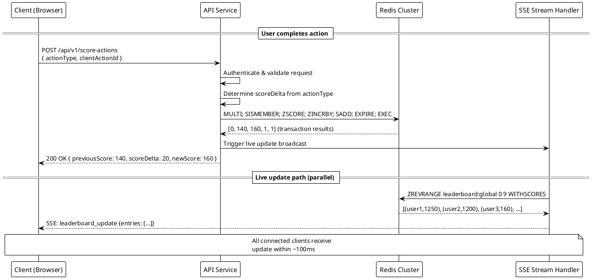

```plantuml
@startuml
!theme plain

participant "Client (Browser)" as UI
participant "API Service" as API
participant "Redis Cluster" as Redis
participant "SSE Stream Handler" as SSE

== User completes action ==
UI -> API: POST /api/v1/score-actions\n{ actionType, clientActionId }
API -> API: Authenticate & validate request
API -> API: Determine scoreDelta from actionType
API -> Redis: MULTI; SISMEMBER; ZSCORE; ZINCRBY; SADD; EXPIRE; EXEC
Redis --> API: [0, 140, 160, 1, 1] (transaction results)
API -> SSE: Trigger live update broadcast
API --> UI: 200 OK { previousScore: 140, scoreDelta: 20, newScore: 160 }

== Live update path (parallel) ==
SSE -> Redis: ZREVRANGE leaderboard:global 0 9 WITHSCORES
Redis --> SSE: [(user1,1250), (user2,1200), (user3,160), ...]
SSE --> UI: SSE: leaderboard_update {entries: [...]}
note over SSE, UI: All connected clients receive\nupdate within ~100ms

@enduml
```